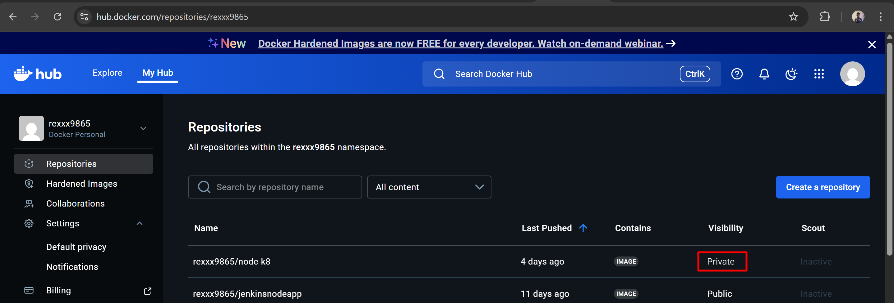
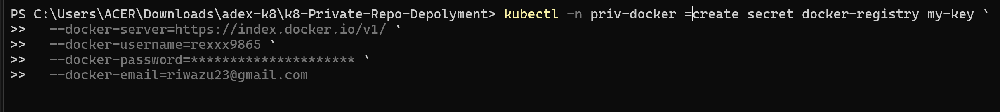
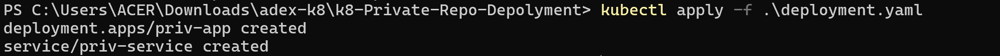
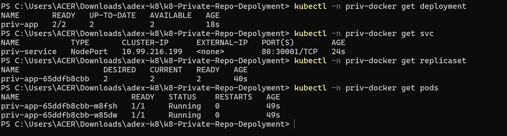
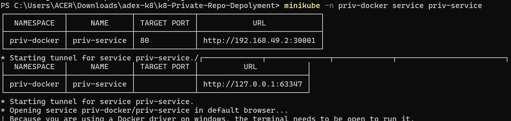
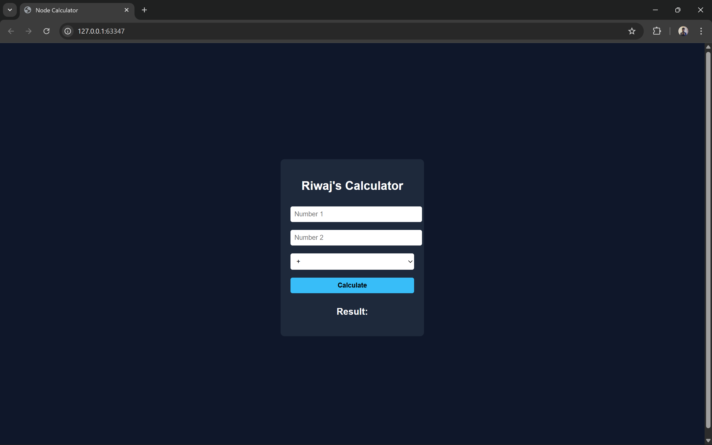

# Task: Deploy your own custom-built Docker Image from a private Container Registry as a K8s Deployment+Service

1. **Create Private repo in DockerHub**


2. **Push the docker image to the private repo in DockerHub**

```
docker tag node-app rexxx9865/node-k8:v1.0.1
docker push rexxx9865/node-k8:v1.0.1
```

3. **Verify**


4. **Create namespace in node**

```
kubectl create ns priv-docker
```

5. **Create Secret in priv-docker namespace**



6. **Verify Secret**


7. **Create Deployment.yaml file**

```
apiVersion: apps/v1
kind: Deployment
metadata:
  labels:
    app: priv-app
  name: priv-app
  namespace: priv-docker
spec:
  replicas: 2
  selector:
    matchLabels:
      app: priv-app
  template:
    metadata:
      labels:
        app: priv-app
    spec:
      imagePullSecrets:
        - name: my-key
      containers:
        - name: priv-app
          image: rexxx9865/node-k8:v1.0.1
          imagePullPolicy: Always

---
apiVersion: v1
kind: Service
metadata:
  name: priv-service
spec:
  type: NodePort
  selector:
    app: priv-app
  ports:
    - protocol: TCP
      port: 80
      targetPort: 3000
      nodePort: 30001
```

8. **Run the YAML file**

```
kubectl apply -f deployment.yaml
```


9. **Verfiy Deployment, Service and Replicaset**

```
kubectl -n priv-docker get deployment
kubectl -n priv-docker get service
kubectl -n priv-docker get replicaset
kubectl -n priv-docker get po
```


10. **Access the Application**

```
minikube -n priv-docker service priv-service
```



