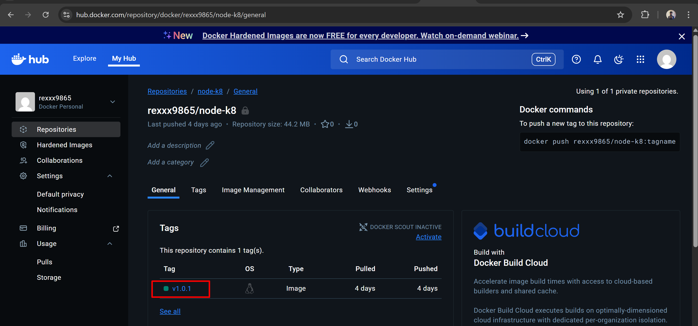

# Deploy your own custom-built Docker Image from a private Container Registry as a K8s Deployment+Service

1. **Create Private repo in DockerHub**


2. **Push the docker image to the private repo in DockerHub**

```
docker tag node-app rexxx9865/node-k8:v1.0.1
docker push rexxx9865/node-k8:v1.0.1
```

3. **Verify**



4. **Create namespace in node**

```
kubectl create ns priv-docker
```

5. **Create Secret in priv-docker namespace**

